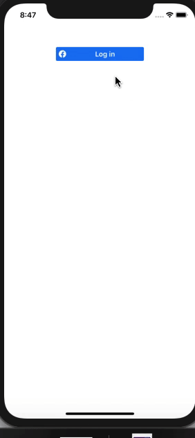
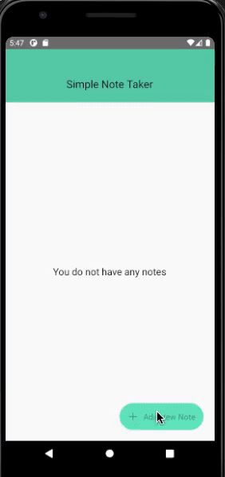

React Native Assignment 8th-April-2021

Create Three Screens

1. Video Player Screen demonstrating Video Player Functionality with progress, pause/play
2. Audio Player Screen. Create a Player with pause/play, next/previous functionality
3. Use Geolocation to fetch user's current location and show marker on the map and any change in user's location should also reflect on the map

 Screenshots

