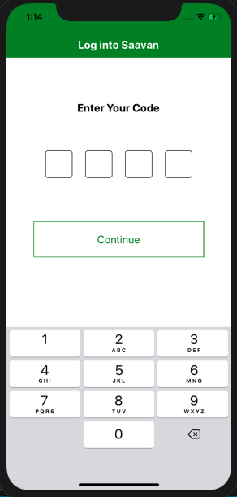
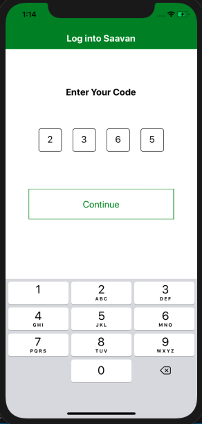
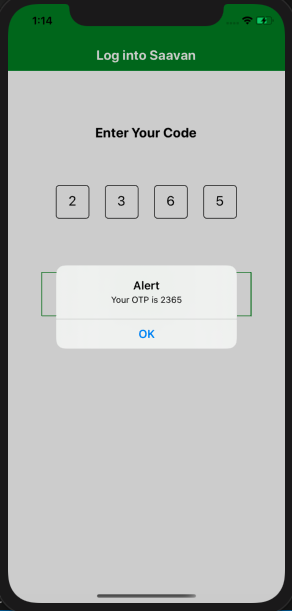
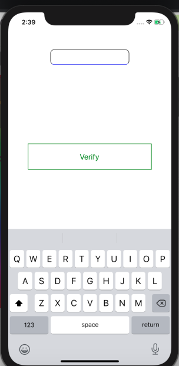
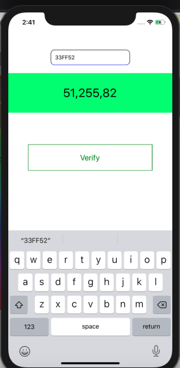
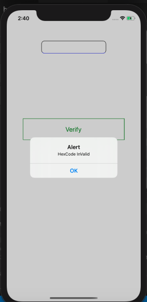
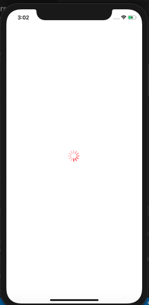
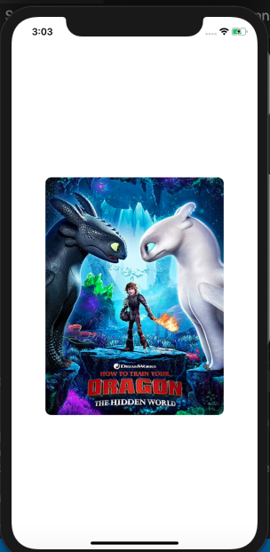

React Native Assignment 3rd-March-2021

Create the screen with design given in the link below alongwith background  image.
 
  
 <a href="https://drive.google.com/file/d/1ot21Mo6zOgiY1gkDPyLw82FKe82eSXws/view?  usp=sharing">Link to Design</a>
  

 
 

Create a text input , text and view alongwith the following steps:-
     You will input the hex code of a color, and validate that hexcode on submit.
      If it is a valid hex code convert it into RGB and show its value in the <Text> 
      Give that RGB value as background color for the <View>.

  
  
 

 

Create a image view and show activity indicator in place of image while it is loaded.
 
 
  
 

