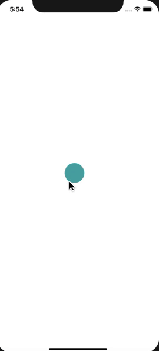
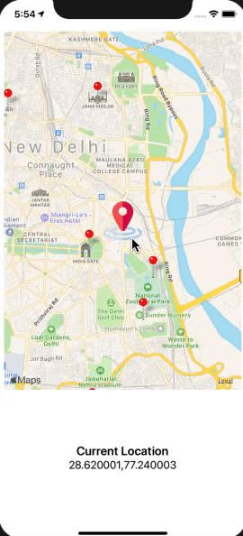
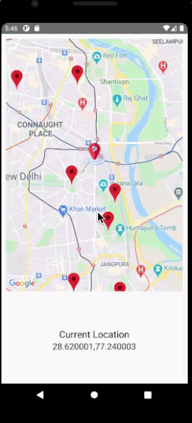

React Native Assignment 17th-March-2021

Create a draggable ball

 Screenshots

Create a map view
<ol>
<li>Show your current location </li>
<li>Set your current location on drag i.e,  current location functionality in zomato application.</li>
<li>Create an array of some static coordinates and show marker for those coordinates on map view.</li>

 Screenshots

