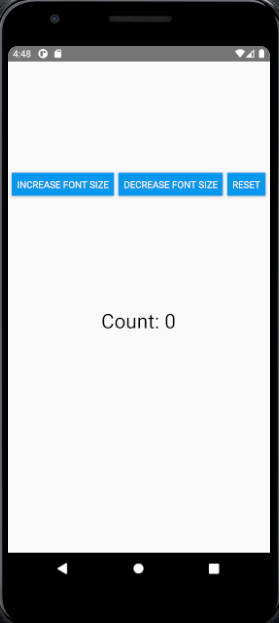
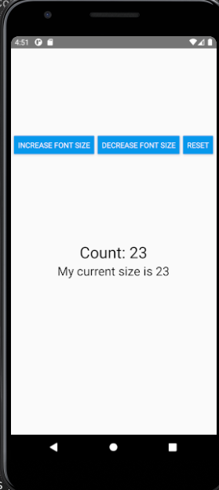

React Native Assignment 26-Feb-2021

**Screenshots**

 

**Life Cycle Of React Native**
Mounting —  When the component is mounted.
Updating — When the state changes the component is updated (Rerender)
Unmounting — the component is not needed and gets unmounted.

**Mounting**
The order is:
constructor(): We initialize states and bind methods here
getDerivedStateFromProps(): It is called in mounting and updating phase.
render():Used only in class component. It is pure and no state updation are done here
componentDidMount(): Called Immediately after component is mounted. Mostly use to call API.
It is only called once during mounting

**Updating**
getDerivedStateFromProps()
shouldComponentUpdate(): Is used if we want to rerender the component or not. (true for rerender and false for no rerender.) Default is true
render()
getSnapshotBeforeUpdate():Called before the dom is actually updated
componentDidUpdate():Called immediately after update occurs

**Unmounting**
componentWillUnMount(): Called immediately before a component is unmounted or destroyed

**The order of lifecycle methods called in Parent and child component**

During Mounting

i)Parent Constructor is called
ii)Parent getDerivedStateFromProps is called
iii)Parent Render method is called
iv)Child Constructor is called
v)Child getDerivedStateFromProps is called
vi)Child Render method is called
vii)Child componentDidMount is called
viii)Parent componentDidMount is called

When some update occur(state change)

i)Parent getDerivedStateFromProps is called
ii)Parent shouldComponentUpdate is called
iii)Parent Render method is called
iv)Child getDerivedStateFromProps is called
v)Child shouldComponentUpdate is called
vi)Child Render method is called
vii)Child getSnapshotBeforeUpdate is called
viii)Parent getSnapshotBeforeUpdate is called
ix)Child componentDidUpdate is called
x)Parent componentDidUpdate is called

Unmounting
i)Component is unmounted when we move to new component