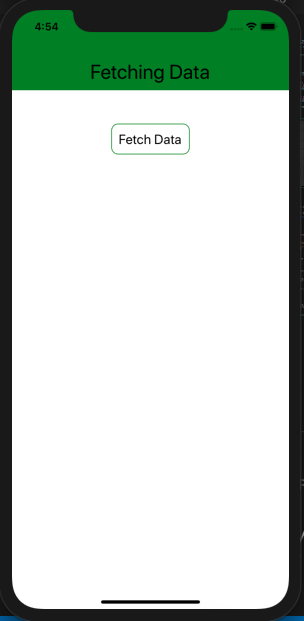
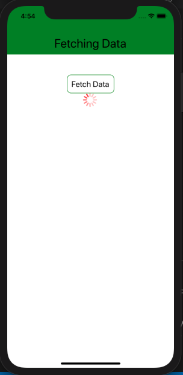
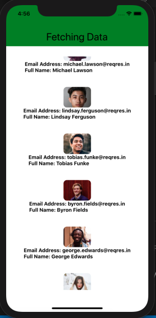

React Native Assignment 4th-March-2021

Create a new Screen 
Add a button FETCH Data
On click present a loader and make an API call 
List the data on the same screen, existing button and loader should be removed
API Path : https://reqres.in/api/users

Method : GET 

Use fetch https://developer.mozilla.org/en-US/docs/Web/API/Fetch_API/Using_Fetch
  

  

